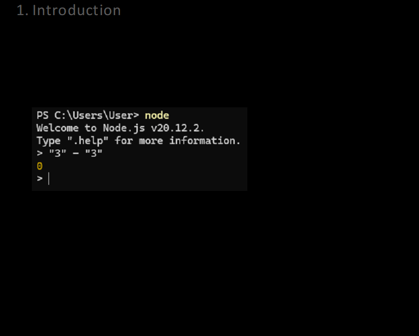

# CA-(P&DB-SPD)-AI (ChatAssistant-(Pie&DarknessBased-ShitPeopleDetector-AI)) Docs

## Introduction

At first: all docs will be written in English, because I’m too lazy to switch to Russian.
All CA-SD-AI (further – The Project) API endpoints use C++ structs to send request body and request response, because 
JSON is too easy. Only C++, only-hard. JSON is piece of shit, because it means JavaScript Object Notation, 
but JavaScript is the worst failure of the humanity. Always remember this:\
\
The Project won’t have a website. Why? Web development is harder, than kernel-level development. 
It is easier to write a Windows Kernel Mode Driver, than simple website. It is easier to write a custom Linux 
kernel, than simple website. Because JavaScript have the worst syntax. Only in JavaScript you could have a 
functions-classes, which will be used as constructor. Because the CSS have the hardest to understand abilities. 
You google “How to center div vertically”, tries 10 answers from SO and… no one from them working! 
So, I decided: The Project will have only API and CLI for use it. And no more. 
May be, there will be 3-rd party bots to wrap over The Project API. If you want some hardcore, you can use 
The Project from Arch Linux CLI without DE installation. Have nice using! I hope, The Project will defeat you from 
whiners, pseudo-suicidal people and just idiots.

## Description
This is an simple AI, which is trained on messages of totally shit people and targeted for detect people like it

## Running
For backend: Install requirements.txt and run backend/server/main.py\
For CLI: each file from CLI folder is python script which sends request to specific endpoint\
For AI training: train.py for model training code and load.py for model loading